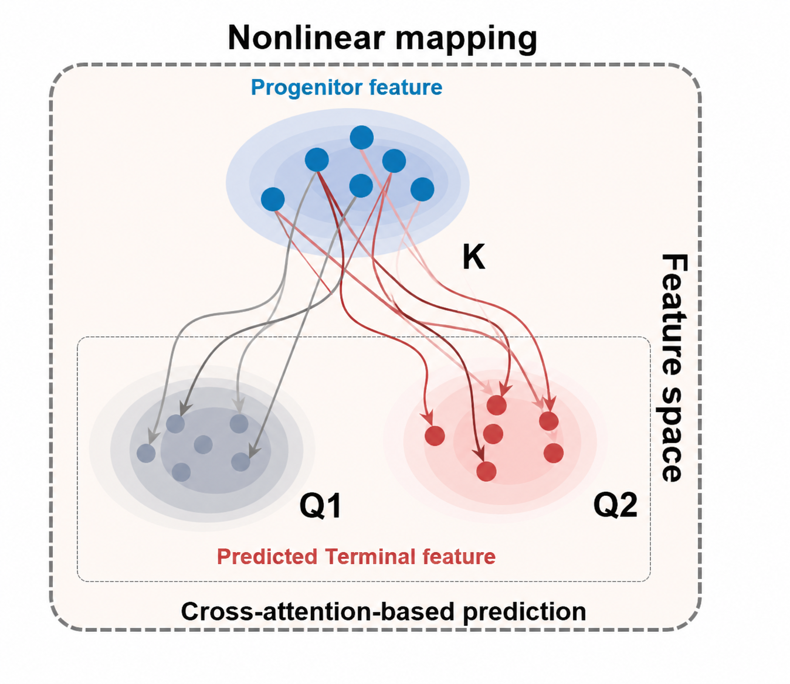

# DyMoTree: Dynamic Cell Fate Modeling Based on Tree-Structured Neural Network

DyMoTree is a deep learning framework for modeling dynamic cell fate transitions by integrating lineage tree structures with single-cell transcriptomic data. It enables robust inference of cell fate bias, identification of fate-specific states, and discovery of underlying molecular mechanisms.

---

## Overview

Understanding how cells evolve and differentiate is fundamental in developmental biology, cancer research, and immunotherapy. DyMoTree introduces a **tree-structured neural network** that:

- Integrates **lineage hierarchy** with gene expression data
- Models **nonlinear cell state transitions**
- Infers **cell fate potentials and trajectories**
- Identifies **fate-associated molecular signatures**

---

## Key Features

- **Tree-Structured Modeling**: Incorporates lineage topology into neural networks
- **Graph-Based Representation**: Builds single-cell resolution lineage graphs
- **Fate Inference**: Accurately predicts early cell fate bias
- **Interpretability**: Identifies key genes and regulatory programs
- **Robustness**: Performs well under noisy and sparse single-cell data

---

## 1. Graph Explanation of Cell Development Landscape

**Description**:  
This graph represents the conceptual landscape of cell differentiation, inspired by Waddington’s epigenetic landscape. It illustrates how progenitor cells evolve into distinct terminal cell types through branching developmental trajectories.

---

## 2. DyMoTree Framework

**Description**:  
This diagram shows the architecture of DyMoTree. The framework combines:

- **CellModule (GAT-based)**: models intra-cell-type transitions  
- **LineageModule (cross-attention)**: models transitions across lineage levels  

Together, they enable hierarchical and nonlinear modeling of cell fate transitions.

---
