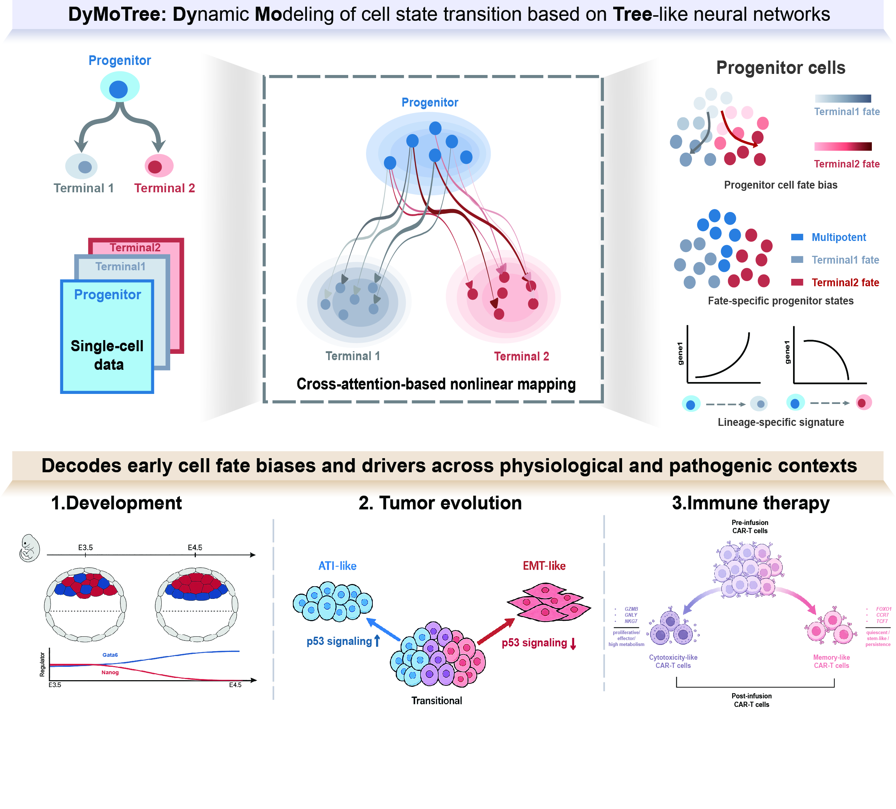

# DyMoTree

DyMoTree decodes early cell-state transitions and lineage-specific drivers from single-cell transcriptomes using a tree-structured neural network.

DyMoTree models progenitor-to-terminal cell-state transitions under an explicit lineage structure and supports three main tasks:

1. inference of early cell fate bias;
2. identification of fate-specific progenitor states;
3. discovery of lineage-specific signature genes.

<p align="center">
  
</p>

<p align="center">
  <b>Overview of DyMoTree for nonlinear progenitor-to-terminal cell-state mapping.</b>
</p>

Preprint: to be added

---

## Installation

```bash
conda env create -f environment.yml
conda activate dymotree
```

Run tutorials from `notebooks/`.

---

## Project Structure

| Directory         | Description                        |
| ----------------- | ---------------------------------- |
| `config/`         | Configuration files                |
| `data/`           | Input and processed datasets       |
| `experiment/`     | Reproducible experiment scripts    |
| `notebooks/`      | Step-by-step tutorial notebooks    |
| `run/`            | Running scripts for major analyses |
| `script/`         | Utility and analysis scripts       |
| `src/`            | Core DyMoTree source code          |
| `test/`           | Test examples                      |
| `environment.yml` | Conda environment file             |

---

## Dependencies

Main dependencies:

**Core Python:** python, pip, pyyaml, tqdm
**Jupyter:** jupyterlab, notebook, ipykernel
**PyTorch:** torch, torchvision, torchaudio, torch-geometric
**Scientific Stack:** numpy, pandas, scipy, scikit-learn, matplotlib, seaborn, h5py, pygam, statsmodels, archetypes, jax, optax
**Graph:** networkx, igraph, pynndescent, umap-learn
**Single-cell:** anndata, scanpy, gseapy, mygene

See `environment.yml` for exact versions.

---

## Input

DyMoTree requires an `AnnData` object containing:

| Field                    | Description                                                                |
| ------------------------ | -------------------------------------------------------------------------- |
| `adata.X`                | Gene expression matrix                                                     |
| `adata.var_names`        | Gene names                                                                 |
| `adata.obs[lineage_col]` | Cell-state annotation                                                      |
| `adata.obsm[emb_key]`    | Low-dimensional embedding for lineage-graph construction, default: `X_pca` |

For a bifurcating lineage, define one progenitor state and two terminal states:

```python
progenitor = "Transitional"
terminal = ["AT1", "EMT"]
```

---

## Quick Start

The example below analyzes transitional LUAD tumor cells and infers their fate bias toward AT1-like and EMT-like states.

```python
import sys
import os
sys.path.append(os.path.abspath("src"))

import scanpy as sc
from dmt import DyMoTree

adata = sc.read_h5ad("data/case/LungCancer/anndata/anndata.h5ad")

dmt = DyMoTree(
    adata=adata,
    k=40,
    progenitor="Transitional",
    terminal=["AT1", "EMT"],
    lineage_col="lineage",
    emb_key="emb",
    device="cuda",
    seed=42,
)

dmt.lineage_graph(
    mask_threshold=0.8,
    epsilon=1,
    mode="composite",
)

dmt.train(
    pre_train="combined",
    lr={"formal": 1e-4, "intra": 1e-3, "lineage": 1e-4},
    iter={"formal": 350, "intra": 100, "lineage": 350},
    sample_ratio=256,
    alpha=0,
)

progenitor = dmt.treedata.get_node("Transitional", adata_object=True)

progenitor.obs["fate_bias"] = dmt.cal_fate_bias(
    progenitor.obs["EMT_fate"],
    progenitor.obs["AT1_fate"],
)

dmt.find_state(
    n_state=3,
    n_pca=5,
    n_diff=5,
    n_gene=10,
    method="spearman",
)

driver_result = dmt.find_driver(
    progenitor="Transitional",
    top_n=100,
    soft_treshold=1,
    graph_threshold=0.0,
    method="spearman",
    model="lasso",
    lasso_alpha=0.1,
)

driver_result.to_csv("table/LUAD.driver.csv")
```

---

## Outputs

| Output          | Description                                      |
| --------------- | ------------------------------------------------ |
| `*_fate`        | Fate potential toward each terminal state        |
| `fate_bias`     | Relative fate preference between terminal states |
| `Fate_State`    | Fate-specific progenitor-state annotation        |
| `driver_result` | Lineage-specific gene contribution table         |

---

## Feedback

Bug reports, questions, and feature requests are welcome. Please open an issue on GitHub.

---

## License

GNU General Public License v3.0. See `LICENSE`.
